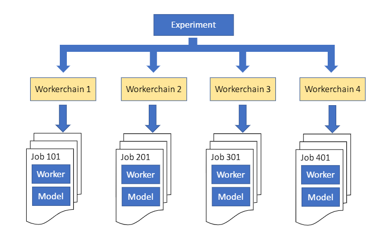
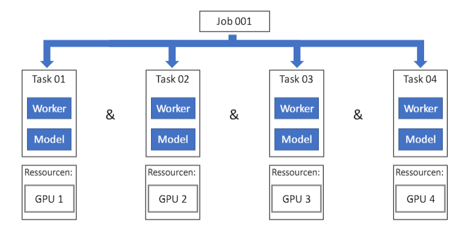
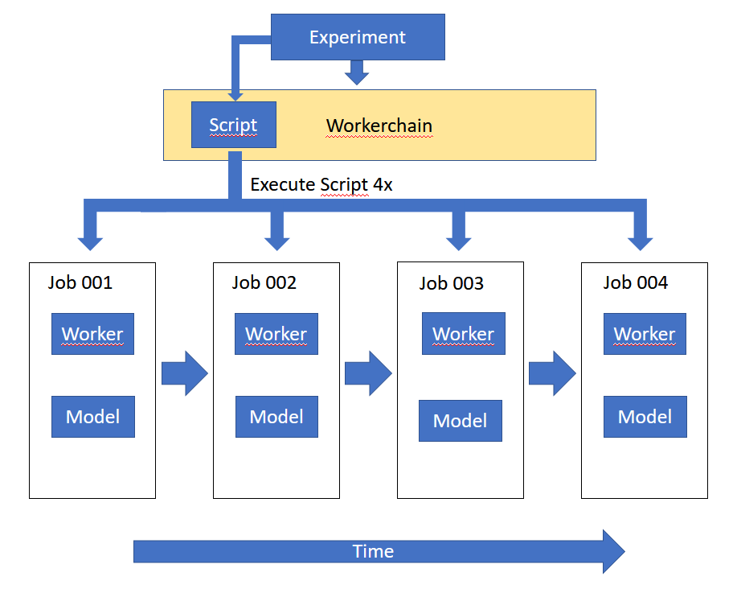

# Tutorial

This Project is a Tutorial to set up your model for hyperparameter search using the 
[cluster-hyperopt repository](https://github.com/aimat-lab/cluster-hyperopt) .

This tutorial is separated into 8 Sections:

- Section 1: Creating a conda environment for this project

- Section 2: Creating a simple model, that is not yet usable for hyperparameter search

- Section 3: A function that will be called by the hyperparameter search algorithm

- Section 4: The config file, that defines all necessary parameters

- Section 5: SigOpt

- Section 6: Other files needed 

- Section 7: Running the Hyperopt 

- Section 8: Appendix: How The implementations of horeka and bwunicluster differ

### Section 1
We assume that you have already installed conda.

Create a new environment using ```conda create -n "tutorial" ```. 
You can name the environment how you want. We chose "tutorial".
Make sure pip is installed inside this environment.
Install sklearn using pip:```pip install -U scikit-learn```

### Section 2
We create a file ```model.py```. It contains the class ```Model```, 
which has functions to create, train and evaluate a random forest classifier imported from sklearn.

As you can see, the train function allows us to set the number of trees (```n_estimators```), 
the splitting criterion (```criterion```), the maximum depth for a tree (```max_depth```), 
if we want to use bootstrapping (```bootstrap```) and how many random features 
should be considered when calculating a split (```max_features```).
```py
from sklearn.ensemble import RandomForestClassifier


class Model:
    rfc = None      # The Random Forest Classifier

    random_state = None

    def __init__(self, random_state=0):
        self.random_state = random_state

    def train(self, X_train, y_train, n_estimators, criterion, max_depth, bootstrap, max_features):
        self.rfc = RandomForestClassifier(n_estimators=n_estimators, criterion=criterion, max_depth=max_depth,
                                          bootstrap=bootstrap, max_features=max_features,
                                          random_state=self.random_state)
        self.rfc.fit(X=X_train, y=y_train)

    def evaluate(self, X_test, y_test):
        return self.rfc.score(X_test, y_test)
```

We now need a function that loads a dataset, creates a Model, trains and evaluates it. 
Therefore we create the file ```main.py``` with the function ```run_without_hyperopt()```.
This function trains the model with the following hyperparameters:
   - n_estimators = 5
   - criterion = 'entropy'
   - max_depth = 5
   - bootstrap = True
   - max_features = 'sqrt'

Now we can execute this function and will see the accuracy of the model in the console.
```py
from model import Model
from sklearn import datasets
from sklearn.model_selection import train_test_split

random_state = 0


def run_without_hyperopt():
    # load and split dataset
    ds = datasets.load_wine()
    X_train, X_test, y_train, y_test = train_test_split(ds.data, ds.target, test_size=0.33, random_state=random_state)

    # train and evaluate model
    model = Model()
    model.train(X_train=X_train, y_train=y_train, n_estimators=5, criterion='entropy', max_depth=5,
                bootstrap=True, max_features='sqrt')
    print(model.evaluate(X_test=X_test, y_test=y_test))


if __name__ == '__main__':
    run_without_hyperopt()
```


### Section 3
In this second section we create a function that will be called by the 
hyperparameter optimizer and returns the accuracy and metadata of the model.
We add this function to the ```main.py``` file.
```run_hyperopt(hyperopt_config=None)``` takes a run configuration as input. 
This configuration contains the suggested hyperparameters for our model.
   1. In part 01 the function extracts the suggestion from the hyperopt_config
   and from the suggestion it can get the values for each hyperparameter
   2. Part 02 is about loading the dataset and splitting it into the train and test parts.
   3. In part 03 the function trains and evaluates the model. Afterwards it returns 
   the result (accuracy) and the metadata. 
   This is important, since the optimizer expects this return format.
```py
def run_hyperopt(hyperopt_config=None):
    # Extract options (Part 01)
    suggestion = hyperopt_config['suggestion']

    n_estimators = suggestion['n_estimators']
    criterion = suggestion['criterion']
    max_depth = suggestion['max_depth']
    bootstrap = suggestion['bootstrap']
    max_features = suggestion['max_features']

    # load and split dataset (Part 02)
    # this is not optimal, since we only need to download the dataset once. We only use this for simplicity
    ds = datasets.load_wine()
    X_train, X_test, y_train, y_test = train_test_split(ds.data, ds.target, test_size=0.33, random_state=random_state)

    # train and evaluate model (Part 03)
    model = Model()
    model.train(X_train=X_train, y_train=y_train, n_estimators=n_estimators, criterion=criterion, max_depth=max_depth,
                bootstrap=bootstrap, max_features=max_features)

    result = model.evaluate(X_test=X_test, y_test=y_test)
    metadata = None
    print(result)

    return result, metadata
```
Right now it is not yet possible to start the hyperparameter search. We first need to write a 
configuration file, which defines all parameters needed for the hyperparameter search.


### Section 4
In the 3rd Section we create the configuration file needed to run the hyperparameter search. 
Do not confuse this configuration file with the hyperopt_config parameter
for the ```run_hyperopt(hyperopt_config=None)``` function, created in section 2.
The config file can be split in roughly 7 parts:
   - **model**
   - **git_options**
   - **experiment**
   - **parameters**: defines all hyperparameters
   - **metrics**: defines the kind of metric and whether to minimize or maximize it.
   - **sbatch_options**: Contains the sbatch options (see Slurm), to add to the execution script. 
                     Important Note: What happens with those options is different for HoreKA 
                     and BWUniCluster, since the parallelization of both differs.
   - **sigopt_options**

We will create the file step by step. Starting with the model options:
```yaml
model:
    dataset_path: "/home/dataset/cifar-10-python.tar.gz" #dummy dataset.
    entry_point: "main.py" # The python file name that includes the function for evaluating the suggestions
    function_name: "run_hyperopt"
    copy_data: true # If the data should be copied in the workspace
```
- The ```dataset_path``` defines the path to a dataset. Right now it is not possible to leave it empty. 
    But we can define a dummy path, that won't be used.
- ```entry_point``` is the python file that includes the ```run_hyperopt(hyperopt_config=None)``` function
- ```function_name``` defines the name of the function that will be executed by the hyperparameter search algorithm.
    In our case: ```"run_hyperopt"```

The next part is about the git options:
```yaml
git_options:
    git_uri: "git@github.com:u-adrian/Tutorial.git"
    branch: "main" # Either branch or version can be used. Using the option version allows to load specific tags
```
- ```git_uri```: The uri to the git repository. This is "git@github.com:u-adrian/Tutorial.git" for this project.
- The ```branch``` defines the branch of the repository.

```yaml
experiment:
    use_local_workspace: false # If a local experiment folder should be created in root folder or a dedicated workspace
                            # directory (https://wiki.bwhpc.de/e/Workspace)
    experiment_name: "tutorial_project"
    cluster: "horeka"  # Either "bwunicluster" or "horeka"
    number_chain_jobs: 4 # How many times should a job - the suggestion evaluation - be chained together. It is used to
                       # cirumvent the problem of time outs in the cluster
    multimetric_experiment: false
```
- ```use_local_workspace```
- ```experiment_name```: The name of the experiment. Will be used to create an experiment on SigOpt.
- ```cluster``` Defines the algorithm to use. You can choose between "horeka" and "bwunicluster".
    This setting has a great effect what happens with the "sbatch_options".
- ```number_chain_jobs``` Since there is a maximum time a job can run on the clusters we need to chain jobs together.


Now we define the hyperparameters that we want to optimize.
- The first hyperparameter is ```max_depth```. The datatype must be integer and we restrict it to an interval from 
    1 to 10.
- We chose the same settings for the number of 
    trees (```n_estimators```) in the forest. 
- The third parameter ```bootstrap``` is a boolean. 
    Since it is not possible to define booleans in "SigOpt" we use the integers 0 and 1.
    We use "grid" in this example, so you can see how to define a set of integers.
- ```max_features``` is a categorical value, and we chose the two options "sqrt" and "log2".
- ```criterion``` is also of type "categorical" with the possible values "gini" and "entropy".
```yaml
parameters:
  - name: max_depth
    type: int
    bounds:
      min: 1
      max: 10
  - name: n_estimators
    type: int
    bounds:
      min: 1
      max: 10
  - name: bootstrap
    type: int
    grid:
      - 0
      - 1
  - name: max_features
    type: categorical
    categorical_values:
      - 'sqrt'
      - 'log2'
  - name: criterion
    type: categorical
    categorical_values:
      - 'gini'
      - 'entropy'
```

Now we define the metrics we want to optimize:
The objective is to maximize it. Set the strategy to "optimize"
```yaml
metrics:
  - name: accuracy
    objective: maximize
    strategy: optimize
```

The ```sbatch_options``` are a crucial part to get the hyperparameter search run properly on
the BWUniCluster and HoreKA. Since the choice of the cluster affects those settings we will discuss the settings
for HoreKA and also for the BWUniCluster. You can find a brief description of both implementations here TODO.

- We use the partition "dev_gpu_4" on the horeka cluster.
- The ```gres: gpu:4``` defines the number of gpus allocated by each job. In this case 4. 
- Each job will execute 4 parallel tasks, to optimize 4 models in parallel. We set ntasks to 4.
- mem-per-gpu corresponds to the memory per task. Use this option to define your memory per tasks. 
Other options like "mem:" or "mem-per-cpu" might not work properly and prevent the tasks to run in parallel.
Make sure that the node has not less than 4x the memory you define here. We choose ```mem-per-gpu: 32000```. That's 32 GB.
- We set the time limit per job to 10 minutes: ```time: "10"```.

[Here](https://slurm.schedmd.com/sbatch.html) you can find a description for all sbatch options.

```yaml
sbatch_options:
  partition: "dev_gpu_4"
  gres: "gpu:4"
  ntasks: 4
  mem-per-gpu: 32000
  time: "10"
```

In the last step we define the ```sigopt_options```.
- ```dev_run: true``` is used to test your implementation. 
    The generated suggestion cannot be used to find good hyperparameters.
    After you tested your application with ```dev_run: true``` and everything works you can 
    change it to ```dev_run: false```, with this setting SigOpt will create useful suggestion.
- ```project_id``` is the ID of your Project, that you created on SigOpt. Make sure, that a project with 
                this ID already exists.
- ```client_id``` Is your Identifier for SigOpt. 
  To find your client id, you need to login to SigOpt and open "API Tokens".
- ```observation_budget``` defines how many hyperparameter-suggestions can be created in total.
- ```parallel_bandwidth``` is the number of suggestion that can be created simultaneously. Set this to the
  number of models you evaluate in parallel.
```yaml
sigopt_options:
  dev_run: false # If the dev api of sigopt should be used to get the suggestions
  project_name: "test_project"
  client_id: 11949
  observation_budget: 60 # Max number of trials
  parallel_bandwidth: 4 # Number of parallel evaluations
```

### Section 5
To let our hyperparameter search run on the server we need a conda environment, 
which includes all dependencies.
For this we create a file "environment.yaml". With this file "cluster_hyperopt" 
can create an environment fully automatically.

Open a shell inside your project folder,
activate the environment and execute the following command:

```conda env export > environment.yaml```

### Section 6
To have access sigopt from the server you need the API Token and Development Token.
We create a file ```sigopt_token``` where we store those tokens:

```
SIGOPT_TOKEN=**********************************************
SIGOPT_DEV_TOKEN=**********************************************
```

You can find your tokens on the SigOpt website: _Your Username_ >
Then we store the path to this file in a system variable:

```export SIGOPT_ENV_FILE=path/sigopt_token```

Now cluster hyperopt can connect to sigopt.

### Section 7

Now we can run the hyperparameter search

```python .../sigopt_hyperopt/hyperopt.py start --config_path=.../hypopt_conf.yaml```

### Section 8: HoreKA and BWUniCluster
This Section is not part of the Tutorial. Its purpose is to explain the differences of the two implementations.
It might also help if you don't know which sbatch_options you have to use (see Section 4). 

**The Main Difference between HoreKA and BWUniCluster is, that it is not possible to run 
multiple jobs on a node on the HoreKA cluster at the same time.**


This images shows the concept of the application running on the BWUniCLuster.
The Experiment starts 4 Workerchains. The jobs 101, 201, 301, 401 run in parallel.
When job 101 finishes job 102 will start (Job 102 is hidden behind job 101 in this image).



Here you can see the concept behind the implementation for the HoreKA Cluster:
The Job 001 starts 4 Subtasks, which can run in parallel. What you cannot see in this image
is the experiment and the workerchain. For this implementation we only use one workerchain
and when job 001 finishes job 002 can start, which will also start 4 parallel subtasks.


Now we have a look on the similarities of both implementations:
In both cases the experiment will create a script and workerchain. 
The workerchain gets the script from the experiment and will execute it 4 times
so that the created jobs are chained together. 

For example: you want you chain 4 jobs and use a parallel bandwidth of 4.

Then the BwUniCluster impl. will create 4x4=16 jobs.

In contrast, the HoreKa impl. will only create 4 jobs.


